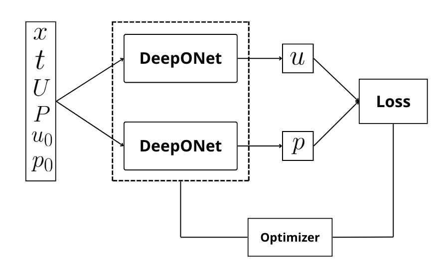
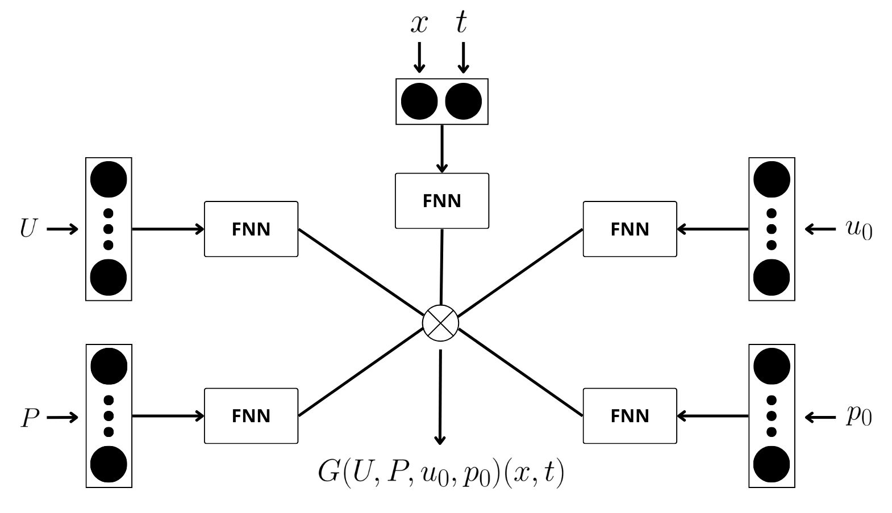
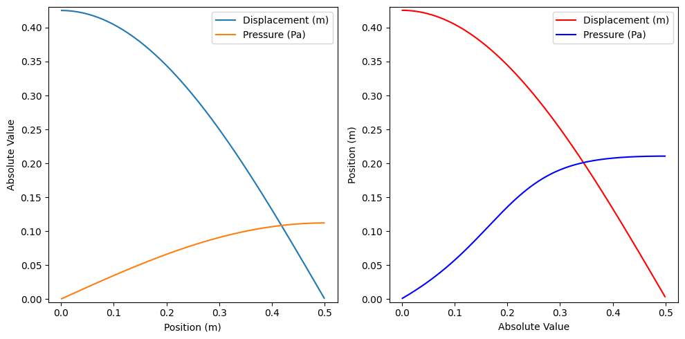

# PI-DeepONets for One-Dimensional Biot Consolidation

This repository contains the code and manuscript assets for a research project on
solving the one-dimensional Biot consolidation model with Physics-Informed Deep
Operator Networks (PI-DeepONets), benchmarked against a classical Gauss-Seidel
finite-volume solver.

Biot consolidation describes the coupled interaction between deformation and
fluid pressure in porous media. The model studied here is a stiff coupled PDE
system with displacement `u(x, t)` and pressure `p(x, t)`.

## Why This Project Exists

Classical numerical methods can solve the model accurately, but repeated
simulations become expensive when the mesh is refined or when source terms and
initial conditions vary. PI-DeepONets offer a different tradeoff: a costly
training phase followed by very fast inference for new inputs.

The original thesis experiments compare:

- a finite-volume Gauss-Seidel solver with implicit Euler time stepping;
- a PI-DeepONet architecture that learns solution operators for displacement
  and pressure;
- manufactured analytical solutions used to evaluate error and stability.

## Repository Layout

```text
.
├── experiments/
│   ├── run_gauss_seidel.py
│   └── train_pi_deeponet.py
├── paper/
│   ├── manuscript.tex
│   └── figures/
├── results/
│   └── figures/
├── src/
│   └── poroelasticity/
│       ├── analytical.py
│       ├── numerical/
│       │   └── gauss_seidel.py
│       └── neural/
│           ├── losses.py
│           ├── model.py
│           └── sampling.py
├── tests/
└── pyproject.toml
```

## Mathematical Model

The one-dimensional model is defined by

```math
-E\frac{\partial^2u}{\partial x^2} + \frac{\partial p}{\partial x} = U(x,t)
```

```math
\frac{\partial}{\partial t}\left(\frac{\partial u}{\partial x}\right)
- K\frac{\partial^2p}{\partial x^2} = P(x,t)
```

where `E` is the elastic modulus, `K` is the hydraulic conductivity, `U` is the
body-force density source term, and `P` is the fluid injection/extraction source
term.

## Highlights From the Thesis Experiments

- The PI-DeepONet is trained with physics-informed losses derived from the PDE
  residuals, boundary conditions, and initial conditions.
- The Gauss-Seidel solver is used as the classical numerical baseline.
- After training, PI-DeepONet inference took approximately 30 ms in the thesis
  experiments.
- Under realistic parameter scaling, the neural method substantially reduced
  pressure error compared with the tested Gauss-Seidel refinements, while the
  classical solver remained stronger for displacement accuracy.

## Selected Figures

PI-DeepONet training flow:



DeepONet architecture for the Biot model:



Comparison between analytical and PI-DeepONet results:



## Quick Start

Create an environment and install the project:

```bash
python -m venv .venv
source .venv/bin/activate
pip install -e ".[dev,neural]"
```

On Windows PowerShell:

```powershell
python -m venv .venv
.\.venv\Scripts\Activate.ps1
pip install -e ".[dev,neural]"
```

Run the numerical baseline:

```bash
python experiments/run_gauss_seidel.py
```

Use larger meshes for thesis-style experiments:

```bash
python experiments/run_gauss_seidel.py --spatial-cells 128 --time-steps 256
```

Run a short PI-DeepONet training smoke test:

```bash
python experiments/train_pi_deeponet.py --epochs 10 --batch-size 16
```

The original thesis used much longer training schedules, including 100,000
epochs for the main experiments.

## Notes

This repository is a curated version of two earlier project repositories:

- `Poroelasticity-NumericalMethods`
- `Poroelasticity-DeepLearning`

The goal of this version is to present the work as a single reproducible
research-engineering project: model, baseline, neural solver, evaluation assets,
and manuscript in one place.
